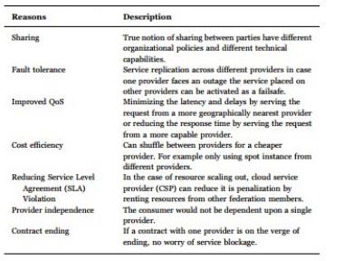
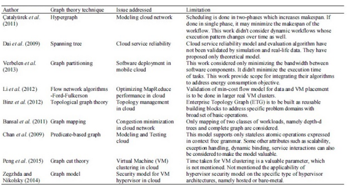

# AN ON-DEMAND AND USER-FRIENDLY FRAMEWORK FOR CLOUD DATA CENTRE NETWORKS WITH PERFORMANCE GUARANTEE

*************************************

P.Srinivas Kumar1, Abhishek Kumar2, Dac-Nhuong Le3, Pramod Singh Rathore2

1 Department of Computer Science & Engineering, Sri Satyasai University of Technology and Med- ical Sciences, Sehore, Madhya Pradesh

2 Computer Science Department, ACERC, Ajmer 

3 Faculty of Information Technology, Haiphong University, Haiphong, Vietnam 

**Abstract**

Distributed computing, a sort of web benefit provisioning model, gives enormous advantages over conventional IT benefit conditions with the assistance of virtualization in- novation. As distributed computing isn’t a completely developed worldview, it postures numerous open issues to be tended to. The key research issue in distributed computing is effective asset provisioning which is because of its unpredictable and dispersed design. Diagram based portrayals of complex systems give less difficult perspectives and chart hypothetical procedures give easier answers for a great deal of issues characteristic in sys- tems. Subsequently, this paper starts with an investigation of chart hypothesis applications in PC systems with a particular spotlight on diagram hypothesis applications in distributed computing. This work focuses on fundamental asset provisioning issues to emerge in dis- tributed computing situations and displays some applied diagram hypothetical recommen- dations to address these issues.

**Keywords:** Computer Network, Cloud Computing, Graph Theory, Resource Provision- ing.

Cybersecurity in Parallel and Distributed Computing. Edited by Dac-Nhuong Le et al. Copyright c© 2018 Scrivener Publishing

 
 
### Introduction

The following stage in the development of dispersed figuring is distributed computing. It acquires existing appropriated figuring models, for example, framework processing, and utility registering and includes extra flavour to be specific virtualization. Extensive scale preparing and capacity of information are particularly rearranged with the approach of savvy distributed computing arrangements. The Cloud Data Center (CDC) is extremely mind boggling with assets circulated all around prompting a few issues. The creators of tended to a few keys and essential distributed computing issues like asset provisioning, security, protection, vitality, and interoperability, however this rundown isn’t restricted. From the point of view of the cloud specialist co-op and cloud benefit customer, these is- sues give diverse pictures. While distributed computing gives chances to relocate the IT business administration’s on the web, these key issues should be settled before it is ac- knowledged as an effective business model 1. This article distinguishes the chances of chart theory 2 based answers for the asset provisioning issues characteristic in distributed computing. To begin with, it begins with chart hypothesis applications in different ter- ritories in PC systems and afterward investigates its reasonableness to address the asset provisioning issues of the cloud. Chart hypothesis is a piece of a discrete arithmetic and valuable structure to display connection between objects. Diagram hypothesis principally discovers its applications in arrange displaying, science, electrical system.

Computational calculations and booking. Diagram hypothetical systems are exceed- ingly utilized by software engineering applications, particularly in demonstrating and steer- ing systems. Speaking to an issue as a diagram can give an alternate perspective and makes an issue substantially easier. It gives apparatuses to taking care of the issue and set of sys- tems for investigating diagrams.

This work has two fundamental parts. The initial segment gives a review of diagram hy- pothesis applications in PC systems. As cloud server farm has an arrangement of intercon- nected frameworks, chart hypothetical arrangements on PC systems can well be connected on a cloud with reasonable changes to address its issues. The second part gives a review of chart hypothesis applications incorporates. The fundamental thought behind this work is to discover the degree for immaterialness of chart hypothesis to address asset provisioning issues in the cloud.

### Key Research Problems in this area

Lot of information by individuals along associations were inbuilt from beginning for cre- ating regarding precisely how securely it is? 2 Problems of disseminated processing 3 that plot.

A. Securely cloud utilizes data by sending to server and storing and retrieving to the client without any data loss or other problems.

B. Relentless quality the cloud servers in like manner experience downtimes and stop- pages to server.

C. Legitimate Problems worries remain by prosperity along protection of single totally along regulatory positions.

D. Consistency numerous headings for identifying and eliminating user requirements

E. Opportunity server handling doesn’t empower customers.  

 
One invalid even your circulated registering provider loses everything or gets got and ate up by a greater association.

### Problems with Interoperability

1) Intermediary Layer it acts as the virtual gateway for perfuming the user tasks without installing on the user device (e.g. VM).

2) Open Standard Standardization has every one of the reserves of being a better than average response for address the interoperability issue. In any case, as conveyed registering just expels, the interoperability issue has not appeared on the crushing arrangement of genuine industry cloud venders.

3) Open API SUN has starting late impelled the Sun Open Cloud Platform 4 under the Creative Commons allow.

4) SaaS and PaaS Interoperability while the beforehand said game plans generally han- dle with IaaS interoperability.

A get-together of authorities in the field of data mining raises the issue of working up a data mining standard on the cloud, with a particular spotlight on ”the handy utilization of factual calculations, solid creation organization of models and the reconciliation of prescient investigation” of the different kinds of services such as Saas, Paas, and Iaas.

## Difficulties on Cloud Adoption Perspective

Based on an overview: Security Well-alluded to security issues, for instance, data mishap, phishing, hat act veritable risks to an affiliation’s data and programming.

- A. The multi-residency show and the pooled enlisting resources on disseminated fig- uring has displayed new security challenges

- B. Costing Model Cloud clients must consider the tradeoffs among count, correspon- dence, and joining.

- C. Charging Model From a cloud provider’s perspective, the adaptable resource pool 5 has made the cost examination fundamentally more tangled than standard server .

- D. Organization Level Agreement It is key for buyers to get guarantees from providers on advantage movement.

## Security and Privacy

Conveyed processing can give unending figuring resources on ask for in light of its high flexibility in nature, which wipes out the necessities for Cloud authority associations to get ready on hardware provisioning. Various associations, for instance, Amazon, Google, and Microsoft and so on, revive their paces in making disseminated processing structures and enhancing its organizations providing for a greater measure of customers. In this paper, we investigate the security and assurance stresses of energy dispersed processing structures gave by a measure of associations [6]:

1. Availability The goal of openness for disseminated processing systems (tallying ap- plications and its establishments) is to ensure its customers can use them at whatever point, at wherever.  

 
2. Confidentiality It infers keeping customers’ data secret in the cloud systems.

3. Data uprightness In the cloud structure means to ensure information dependability (i.e., not lost or balanced by unapproved customers).

4. Control In the cloud structure means to deal with the use of the system, including the applications, its establishment and the data.

5. Audit It expects to watch what happened in the cloud system. Auditability could be incorporated as an additional layer in the virtualized movement system

### Resource Provisioning

The creators of recommended that dissimilar to customary asset provisioning where assets are provisioned as it seems to be, cloud requests proficient asset provisioning calculations to arrangement virtualized assets to meet SLA necessities. Virtualized server farms are imagined to give better administration adaptability, bring down cost, versatility, better as- sets use and vitality proficiency, yet virtualization isn’t a simple assignment to do. Security The creators of [7-9] talked about that clients and corporate data dwell on outsider frame- works, nobody can ensure how secure the information are. It is inclined to spillage of data and assault. Its a basic issue that ought for prevention of of by all the cloud specialist co- ops to hold their business in the market. They should find a way to ensure information and its protection. Five most illustrative security and protection traits secrecy, trustworthiness, accessibility, responsibility, and protection preservability.Cost The creators of [10-13] pro- posed that the general population cloud offers pay per utilize, which can give minimal effort alternatives to here and now projects. Still, for long haul utilize, venture IT associ- ations might be in an ideal situation making a capital speculation to buy extra equipment and programming. Endeavours need to direct an earn back the original investment inves- tigation to decide if open or private cloud would be more savvy for them. From the point of view of the supplier, they are keen on consumer loyalty and creating income out of their administrations. From the point of view of a purchaser, they are occupied with financially savvy arrangements. To adjust these two focuses, practical cloud arrangements should be created.

#### Unwavering quality

The makers of [14-18] communicated that in light of high system unusualness and flowed structure, even absolutely assembled data cnters are subject to incalculable. Accuse tolerant structures should be attempted to address unflinching quality concerns. Because of the reflection thought of cloud condition, there develops a need to become new or expand ordinary accuse tolerant techniques. VM movement and server cementing is the major undermining factor for adjustment to non-basic disappointment as they obtain advantage downtime.

#### Interoperability

The creators of [19-22] expressed that interoperability of heterogeneous cloud stages is troublesome in view of this unmistakable hypervisor and VM advances. The stages likewise utilize different security measures and administration interfaces. Numerous mer- chants with various item measures posture challenges for interoperability. Cloud selection will be ceased if there isn’t a decent method for coordinating information and applications crosswise over mists; henceforth a bound together cloud interface and open guidelines should be developed Energy .  

 
The creators of [23-26] expressed that expanding interest for computational power prompts setting up vast scale server farms. On the opposite side, the power utilization of these vast scale server farms is tremendous. Subsequently, the outline of vitality proficient equipment and keen asset administration systems are required. Because of gigantic power utilization, carbon dioxide (CO2) outflow is likewise 8 all the more adding to the nursery impact. Henceforth the quantity of practices should be connected to accomplish vitality efficiencies, for example, change of utilizations’ calculations, vitality effective equipment, and vitality proficient asset administration methodologies on a virtualized information cen- ter.Out of all these previously mentioned key issues, this work gives careful consideration to asset provisioning issue and use of chart hypothesis on it. Resources giving in cloud. The term cloud administrations are a general class that envelops the bunch IT assets gave over the web. The articulation may likewise be utilized to portray proficient administra- tions that help the determination, arrangement and progressing administration of different cloud-based assets.

### How we define cloud?

The principal feeling of cloud administrations covers an extensive variety of assets that a specialist organization conveys to clients through the web, which, in this unique cir- cumstance, has comprehensively turned out to be known as the cloud. Qualities of cloud administrations incorporate self-provisioning and versatility; that is, clients can arrange- ment benefits on an on-request premise and close them down when no longer essential. Furthermore, clients normally buy in to cloud administrations, under a month to month charging game plan, for instance, instead of pay for programming licenses and supporting server and system framework forthright. In numerous exchanges, this approach makes a cloud-based innovation an operational cost, instead of a capital cost9. From an adminis- tration stance, cloud-based innovation gives associations a chance to get to programming, stockpiling, register and other IT foundation components without the weight of keeping up and redesigning them.

### Public vs. private cloud-based services

Cloud benefits that a specialist co-op offers to various clients through the web are alluded to as open cloud administrations. The SaaS, PaaS and IaaS suppliers noted above may all be said to give open cloud-based administrations.

Private cloud administrations, interestingly, doesn’t made and large accessible to an individual or corporate clients or endorsers. Private cloud-based administrations utilize advances and methodologies related with open mists, for example10, virtualization and self-benefit. Be that as it may, private cloud administrations keep running without anyone else framework and are devoted to inside clients, as opposed to various, outside clients.

#### Cloud services

The second feeling of cloud administrations includes proficient administrations that empower clients to convey the different kinds of cloud administrations. Counselling firms, frameworks integrators, and other channel accomplices may offer such administrations to enable their customers to embrace the cloud-based innovation.

In this unique situation, cloud administrations may incorporate any or the majority of the accompanying offerings: cloud-availability appraisal, application legitimization, relo-  

 
cation, organization, customization, private and open cloud combination - half breed mists - and progressing administration. Organizations represent considerable authority in cloud administrations have turned into an appealing securing focus for vast IT administrations suppliers - Accenture, IBM, and Wipro, for example - that look for mastery in cloud coun- selling and arrangement 11.

#### Cloud services vs. web services

Cloud administrations are infrequently considered synonymous with web administrations. The two fields, albeit related, are not indistinguishable. A web benefit gives an approach to applications or PCs to speak with each finished the World Wide Web.

####  Efficient Monitoring for Provisioning CDC Resources

Errand booking, stack adjusting is confounded distributed computing condition because of its unique heterogeneous design, dynamic conduct and asset heterogeneity. Observing of assets is required before performing booking and load adjusting.

#### Optimal VM Placement and Migration in CDC for Energy-Efficient Resource Provisioning

Keeping a considerable measure of PMs and VMs running in the server farm devours more vitality, prompting higher working expenses. Thus recognizing physical machines with slightest load and moving its heap to some other physical machines and after that closing them down spares vitality. Preservation of vitality might be better accomplished through ideal arrangement of VMs on the PMs and performing VM movements, with the goal that vitality utilization might be kept up at an attractive level 12.

#### Appropriate Locating of CDCs and Allocation of CDCs to the Source of Re- quests

The solicitations for the CDC administrations can originate from various parts of the world. The term wellspring of demands/customers indicate the clients who make solici- tations to different cloud server farm administrations. The separation between the cloud server farm and the wellspring of solicitations is a main consideration affecting the nature of administration as far as reaction time and idleness. Cloud server farm designation is one of the significant issues in distributed computing 13. A proficient designation of cloud server farm to the wellspring of solicitations may enhance the nature of administrations.

#### Clustering Distributed CDCs for Faster Server Provisioning

Regularly cloud server farms are conveyed over the world to expand the accessibility of administrations by remote-reflecting, replications which are the sort of excess systems. It is conveyed basically for fiasco recuperation 14. Grouping locale astute sent cloud data cnters will give fast reactions.

#### Uniform task of customers to CDC servers

In a conveyed cloud server farm condition, stack adjusting systems guide the solicitations to the nearest source or to the source with the ablest ability to serve the demand. Assortment of calculations is utilized to perform stack adjusting. Be that as it may, there is an exchange off dependably exists between picking the nearest cloud server farm and adjusting the heap of cloud server farm. Now and again a cloud server farm nearer to the client area might be over-burden condition, for this situation, the solicitations will be di- rected to a far off cloud server farm which is equipped for taking care of the solicitations. Subsequently, there emerges a need to manage this exchange off which may think about both closeness and load in the meantime.  

 
### Traffic-Aware VM Migration to Load Balance Cloud Servers

After getting the heap data, cloud merchant must conjure stack adjusting methodology to disseminate the heap consistently over the hosts in the CDC. It should be possible by relo- cating a portion of the VMs 15 from over-burden hosts to under loaded has considering just server-side imperatives. System side requirements additionally should be considered to upgrade the execution of CDCs.

#### Graph Theory Applications in Computer Networks

This area rundown of a portion of the works, which connected diagram hypothesis in different kinds of a PC network. Table 10.1 records a portion of the conceivable chart hypoth- esis applications in different sorts of system. Since the cloud is somewhat arrange, these conventional chart hypothetical procedures can be broke down for their appropriateness to address asset provisioning issues in cloud and furthermore introduces some calculated recommendations for it.

**Table 10.1** Grap theory in computer networks

#### Graph Theory Applications in Cloud Computing

This segment gives a rundown of works, which connected diagram hypothesis in the cloud. The creator of 14 proposed a heuristic in light of hyper graph and its apportioning for advancing logical work process execution. The creator of 15 displayed the depend- ability of the cloud administrations. This paper models organize disappointment, flood dis- appointment, timeout disappointment, and asset missing disappointment, equipment dis- appointment, programming disappointment and database disappointment disappointments  

utilizing Markov models 16, Queuing Theory, and Graph Theory. The creator of 17 investigated how to ideally convey programming applications on the offered framework in the cloud, limiting the system use. Particularly with regards to portable registering. They outlined and assessed diagram apportioning calculations that allot programming, segments to machines in the cloud while limiting the required transfer speed. The creator of 18 proposed CAM, a cloud stage that gives an imaginative asset scheduler especially intended for facilitating Map Reduce applications in the cloud 17.

CAM utilizes a stream organize based calculation that can enhance MapReduce execu- tion under the determined limitations. The creator of proposed Enterprise Topology Graphs (ETG) as the formal model to depict a venture topology. The creator of 16 spoke to the physical system of the cloud as diagram thinking about the goal of limiting the blockage. The creator of 18 figured a registering cloud as a sort of chart, a processing asset, for example, administrations or licensed innovation get to rights as a trait of a diagram hub furthermore, the use of the benefit as a predicate an edge of the graph. It in like manner proposes to indicate cloud estimation as a course of action of routes in a sub-chart of the cloud to such a degree, 19 to the point that each edge contains a predicate that is surveyed to be valid. At last, it acquaints a course of action of figurings with frame cloud estimations and model-based testing criteria for test cloud applications. The creator of 5 constructed a strategy for VM 20 bunch by vitality minimization in view of chart hypothesis.

At that point, they changed the sending of VM bunch into the most extreme stream least cut issue lastly cut framed 21 for VM group. The creator of portrayed a formal security show for virtual machine hypervisors incorporate frameworks in view of the chart theory 22. From Table 10.2, it is watched that lone an exceptionally negligible writing is accessible on diagram hypothesis applications to incorporate and the vast majority of these works ignored its application asset provisioning. In this way, it opens a ton of chances to apply diagram hypothetical procedures to address asset provisioning issues in the cloud.

**Table 10.2** Grap theory in cloud

The accompanying area displays some applied proposals for applying diagram hypoth- esis for asset provisioning issues in distributed computing.CAM uses a stream compose based estimation that can upgrade Map-Reduce execution under the decided restrictions. The maker of 19 proposed Enterprise Topology Graphs (ETG) as the formal model to delineate a wander topology. The maker of 20 addressed the physical arrangement of the cloud as an outline considering the objective of constraining the blockage. The maker of 21 figured an enlisting cloud as a kind of outline, a handling resource 23, for instance, organizations or authorized development get to rights as a characteristic of a chart focus point and the use of the preferred standpoint as a predicate an edge of the outline. It re- sembles way proposes to exhibit cloud estimation as a strategy of courses in a sub graph of the cloud to such an extent, to the point that each edge contains a predicate that is assessed to be valid. At last, it familiarizes an approach of tallies with shape cloud calculations and model-based testing criteria for test cloud applications. The maker of 24 constructed a technique for VM bundle by imperativeness minimization in perspective of diagram theory. By then, they changed the sending of VM bundle into the most extraordinary stream slight- est cut issue in conclusion cut encircled for VM gathering. The maker of 25 depicted a formal security appear for virtual machine hypervisors join structures in perspective of the graph theory. From Table 10.2, it is watched that solitary an especially unimportant written work is open on chart speculation applications to consolidate and most by far of these works disregarded its26 application resource provisioning. Thusly, it opens a huge amount of opportunities to apply chart theoretical methods to address resource provision- ing issues in the cloud.

The going with region shows some connected 27 recommendations for applying graph theory for resource provisioning issues in conveyed registering.

## Conclusion and Future Work

In this analysis, an investigation is done on the utilization of diagram hypothesis ideas in PC systems and its reasonableness to address asset provisioning issues in the cloud. In future, we might want to investigate its extension in other research territories of distributed computing.
