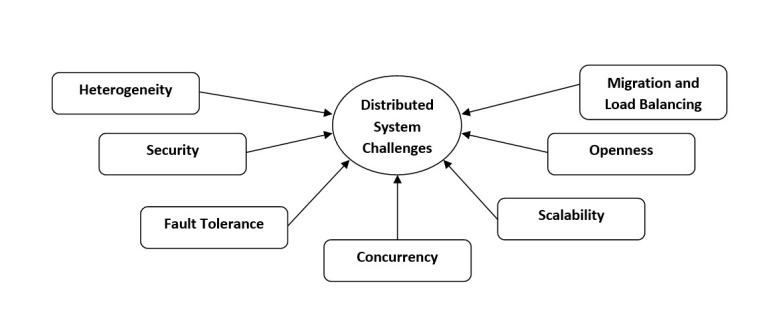
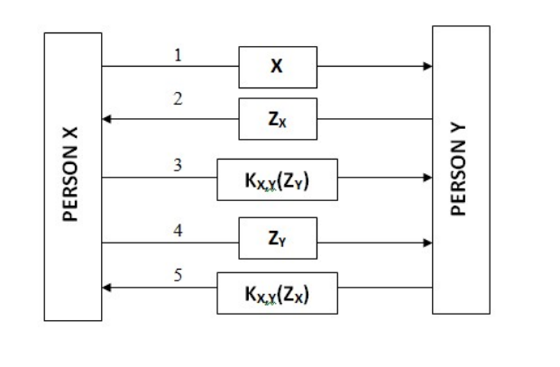
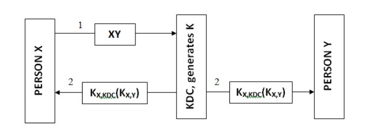
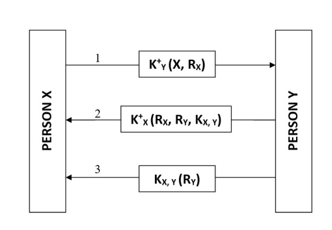
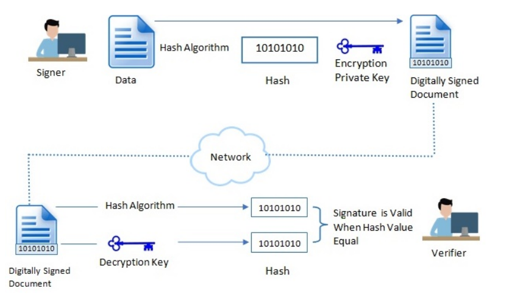
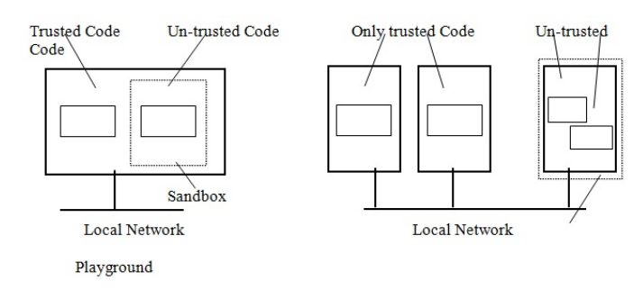

# CYBER-SECURITY TECHNIQUES IN DISTRIBUTED SYSTEMS, SLAS AND OTHER CYBER REGULATIONS

Soumitra Ghosh, Anjana Mishra, Brojo Kishore Mishra

C. V. Raman College of Engineering, Bhubaneswar, Odisha, India Email: soumitraghosh311@gmail.com, anjanamishra2184@gmail.com, brojokishoremishra@gmail.com

**Abstract** 

This chapter emphasizes on various cybersecurity techniques meant for parallel as well as distributed computing environment. The distributed systems basically are candidates for giving increased performance, extensibility, increased availability, and resource shar- ing. The necessities like multiuser configuration, resource sharing, and some form of com- munication between the workstations have created a new set of problems with respect to privacy, security, and protection of the system as well as the user and data. So new age cybersecurity techniques to combat cybercrimes and protect data breach is the need of the hour. The chapter also focuses on the need of service level agreements (SLA) that prevails between a service provider and a client relating to certain aspects of the service such as quality, availability, responsibilities. The Cuckoo’s Egg lessons on cybersecurity by Clif- ford Stoll as well as various amendments to curb frauds, data breaches, dishonesty, deceit and such other cybercrimes have also been thoroughly discussed here.

**Keywords:** Cybersecurity, Cybercrime, Threat, Security, Computing, Computer secu- rity, Risk, Vulnerability, Parallel, Distributed

## Introduction

Distributed computing is a more generic term than parallel computation. More often than not, both terms are used interchangeably. Unlike Parallel computing where concurrent execution of tasks is the working principle, Distributed computing deals with additional capabilities like consistency, partition tolerance and availability.

A system like Hadoop or Spark is an example of distributed computing system that is highly robust and reliable in the sense that it can handle node and network failures. Such systems achieve data loss prevention through data replication over multiple nodes in the network. However, both systems are also designed to perform parallel computing. Unlike HPC systems like MPI, these new kinds of systems are able to continue with a massive calculation even if one of the computational nodes fail.

### Primary Characteristics of a Distributed System

A distribution middleware connecting a network of autonomous computers is known as a distributed system. Any typical arrangement of a distributed system enables users to share different resources and capabilities with a solo and integrated consistent network.

- Concurrency: Enabling sharing of resources by various nodes in a distributed setup at the same time is the concept behind concurrency.

- Transparency: The perception of the system as a single unit instead of an assembly of autonomous components is the main idea behind transparency. The aim of a dis- tributed system designer is to hide the complexity of the same as much as possible. Transparency parameters can be usage permissions, relocation, concurrency, break- down, diligence and user resources.

- Openness: The objective of Openness is to design the network in a way that can be easily configured and/or modified. Developers often require adding new features or modify/replace any existing feature in any distributed node, which is easily facilitated if there is proper support for interoperability based on some standard protocols. Also, well defined interfaces smoothen the process 1.

- Reliability: Distributed Systems are capable of being high resistant to failures, secure and more consistent when compared to a single system.

- Performance: Performance wise also, distributed system outperforms an autonomous system by a huge margin by enabling maximum utilization of resources.

- Scalability: Any distributed system must be designed keeping it mind that it may have to be extended or what we call scaling based on future requirement or increas- ing demand. A system may demand scaling on parameters like geography, size or administration 1.

- Fault Tolerance: Fault tolerance and reliability of a system can be considered close neighbors. A fault tolerant system is one that provides high reliability even in the toughest of scenarios, be it subsystem failures, network failures, etc. Providing se- curity to the system in varieties ways possible like increasing redundancy of data, preventing denial of service (Dos) attacks, upgrading the level of resilience of the system, etc makes a system a fault tolerant one.  

 
### Major Challenges for distributed systems

**Heterogeneity:** Services and applications spanning a varied group of computers and net- works can be used, run, accessed by users over the Internet.. Hardware devices of different variants (PC, Tablets. etc) running various Operating systems (Windows, iOS, etc) may need to exchange information or communicate among themselves to serve a particular pur- pose. Programs written in unlike languages will be able to converse with one another only when these dissimilarities are dealt with. For this to take place, like the Internet protocols, standards require to be agreed and accepted too 3. The word middleware applies to a software layer that provides a programming abstraction in addition to masquerading the heterogeneity of the core networks, programming languages and operating systems hard- ware.

A program code that can be relocated from one computer to a different one and executed at the destination is referred as a Mobile Code. One such example of mobile code is Java applet.

**Figure 7.1** Challenges in Distributed System

**Security:** While using public networks, security becomes a huge concern with respect to distributed environment. Security can be provided broadly in terms of confidentiality (protection alongside revelation to illegitimate persons), integrity (protection alongside modification or dishonesty) and availability (protection alongside meddling with the ways to use the resources) must be provided in DSS. Encryption procedures can be used to fight these concerns such as those of cryptography, but they are still not supreme. Denial of Service (DoS) attacks can still take place, where a server or service is showered with fake requests usually by botnets (zombie computers). The possible threats are data leakage, integrity infringement, denial of services (dos) and illegal handling.

**Fault Tolerance and Handling:** Fault tolerance becomes more complicated when some unreliable components becomes an integral part of the Distributed system. Distributed Systems requires the fault tolerating ability of a system and function normally. Failures are unavoidable in any system; some sub-system may stop functioning whereas others go on running fine. So as you would expect we require a means to Failures detection (by employing several techniques like issuing checksums), Failures in Mask (by retransmitting upon failure to obtain acknowledgement), Failures recovery (by rolling back to a previous safe state if a server crashes), Build Redundancy (by replicating data to prevent data loss in case a particular system in the network crashes).

**Concurrency:** Numerous clients trying to ask for a shared resource at the same moment may lead to concurrency issues. This is critical as the results of any such information may depend on the completion order and so synchronization is needed. Moreover, Distributed  Systems do not have a global clock hence need for synchronization becomes more evident for proper functioning of all components in the network.

**Scalability:** Scalability issues arise when a system is not well equipped to handle sud- den boost of any of count of resources or count of users or both. The architecture and algorithms must be efficiently used under this situation. Scalability can be thought of com- prising primarily three dimensions: Size: Size represents the count of users and resources to be processed. Difficulty that arises in this scenario is overloading

**Geography:** Geography represents the distance linking users and resources. Difficulty that arises in this scenario is communication reliability.

**Administration:** As the dimension of distributed systems grows, many of the nodes need to be controlled. Difficulty that arises in this scenario administrative chaos 3.

**Openness and Extensibility:** Interfaces should be alienated and openly obtainable to facilitate trouble-free additions to existing components and put in fresh components 2. If the well-defined interfaces for a system are available, it is easier for developers to insert fresh features or substitute components in the future. Openness issues become serious when an already published content is suddenly taken back or reversed. Besides, often than not there is no central authority in open distributed systems as dissimilar systems may have their personal mediator. For Example, organizations like Facebook, Twitter, etc allows developers to build their own software interactively through their API 2.

**Migration and load balancing:** Some sense of independency must exist among tasks and users or applications so that when certain tasks are required to move within the system, other task of users or applications are not affected and the to get a better performance out of the system, the load must be distributed among the available resources.

## Identifying Cyber Requirements

Before putting ourselves into the world of Internet, few things need to be very clear in our head if we need to distance ourselves from cyber-bullies or prevent any privacy breach of our personal data. As a matter of fact, having answers to a few layman’s questions would come real handy to us before we start our journey in this cyber-world.

- Who has certified way in? (Would address issues related to confidentiality).

- Who is allowed to craft alterations to the information? (Would address issues related to integrity).

- When there is a need to access the data? (Would address issues related to availability) [4].

The CIA triad, that is Confidentiality, integrity and availability, is a representation based on which standards are framed to provide data security to a company. AIC triad, as it is often called by many to avoid any confusion with the Central Intelligence Agency.

In this context, confidentiality ensures that the information is received by the correct person for whom the information was actually intended by the sender. Integrity ensures the message or information received by the receiver is the original message that was actually sent by the sender and no sort of modification or alteration of the actual message was done during the message transmission. Availability is a assurance of trustworthy right of usage to the data by authentic people.

There are other factors besides the CIA triad which have grown importance in recent years, such as Possession or Control, Authenticity, Non-Repudiation.  

 
## Popular security mechanisms in Distributed Systems

### Secure Communication

Suitable adjustments are made to provide a safe medium of communication amid clients and servers so that the CIA factors are preserved. Secure channel provides a safe way of communication between a client and a receiver preventing any intrusion of a third party from happening so that the confidentiality and/or integrity and/or authentication is not compromised. There are several protocols by which we achieve this purpose. Here we will discuss few protocols that helps to preserve the authentication factor 5.

#### Authentication

Authentication and Integrity are inter-dependable. For instance, consider a disseminated framework that supports verification in aid of a relationship, however does not give rules to guaranteeing the uprightness of the information. Alternatively, if a framework just ensures data truthfulness, while there is no measure for validation. In this way, the information au- thentication and truthfulness must be as one. In numerous conventions, this mix functions admirably. To guarantee truthfulness of information once they are exchanged subsequent to right verification, we make use of special keys encrypted to the session keys. Session key, which is a shared secret key, applies to the encryption of information truthfulness (In- tegrity) and discretion (Confidentiality). Such key is usable while, the set up channel exists. At the point when the channel is shut, the session key is lost. Here we will talk about the verification strategies in view of the session key [6, 7].

#### Shared keys Authorship based Authentication 

Figure 7.2 depicts an authentication protocol based on shared keys. If a person, say X,wish to build a communication channel with another person, say Y, there communication is facilitated by sending a request message (say message1) by X to Y.

**Figure 7.2** Shared secret key based Authentication

Message2, through which the challenge ZY is sent back to X from Y. This challenge can compromise of any random number. X encrypts the challenge with the secret key KX,Y , which is shared by y and sends the encrypted challenge to Y in form of message3. At that point, when Y gets a respond from KX,Y (ZY ) to its own challenge ZY , ad to check whether ZY is included or not, he decrypts the message using the shared key. Like this fashion, he knows X exists on the other side and figures out who else is required  for encryption of ZY with ZX,Y . Y exhibits that talks with X, however X still did not demonstrate talks with Y, so he sends the challenge ZX (via message4) that it is answered with return of KX,Y (RX) (via message5). X is assured speaking with Y when it decodes message5 to find KX,Y and ZX . In this fashion, (N(N − 1))/2 keys would be required to manage ’N’ hosts.

#### Key Distribution Center based Authentication 

Key Distribution Center (KDC) is another technique which can be utilized as an authentication method. Key Distribution Center works together with among hosts for secret key, but no two hosts are required to have shared key. With Key Distribution Center, it is important to deal with N keys.

**Figure 7.3** Role of KDC in authentication

Figure 7.3 shows the working of this way of authentication. X expresses its interest to communicate with Y by sending a message to the Key Distribution Center. A message is returned to X by the Key Distribution Center that contains secret shared keys KX,Y which can be used by X. Furthermore, the shared key KX,Y which is encrypted by secret key KY , KDC is send by the Key Distribution Center to Y. Needham-Schroeder verification practice is outlined in view of this model 6.

**Figure 7.4** Public key encryption based Mutual Authentication

#### Public key encryption based authentication

Figure 7.4 depicts the usage of public key cryptography as an authentication protocol.X being the first person, make the first move of sending challenge ZX to user Y, which is encrypted by its public key K + Y . A challenge must be sent to X by Y after the later decrypts the message. X is assured of communicating to Y, in view of the fact that Y is the only user who can decrypt this message by means of the private key associated to public key of X. When Y receives the channel establishment request from X, it returns the decrypted challenge accompanying its own challenge ZY to authenticate X and generate session key Kx,y .

An encrypted message with public key K + X related to X includes Y response to the challenge X, own challenge ZY and session key that is shown as message 2 in figure. Only X is able to decrypt the message using the private key K −X related to K + X . Finally, X returns his respond to the challenge Y using the session key KX,Y which is produced by B. Therefore, it has proved that can decode messages 3 and in fact, Y talk to X 5.

### Message Integrity and Confidentiality

Besides authentication, a safe medium must also pledge confidentiality and integrity. In- formation truthfulness states that there should be no modification in the message during transmission of the same from the sender to the recipient. Confidentiality ensures that messages reach the intended receiver and not to any eavesdropper. Message encryption helps us achieve Confidentiality. Cryptography can be carried out by using shared secret key with recipient or by means of the public key of the recipient [8, 9].

#### Digital Signatures 

A Digital Signature can be thought of the digital counterpart of a handwritten signature or printed seal that offers better security than conventional signatures. A computerized Signature guarantees approval of confirmation and respectability of any message or elec- tronic report. Uneven cryptography which is a sort of open key cryptography frames the premise of advanced marks. By the utilization of an open key calculation, for example, RSA, two keys can be created, one private and one open. To make an advanced mark, marking programming, (for example, an email program) makes a restricted hash of the electronic information to be agreed upon. The private key is then used to encode the hash.

**Figure 7.5** Digital Signature

The encoded hash alongside other data, for example, the hashing calculation involves the computerized signature. The purpose behind encoding the hash rather than the whole  

 
message or report is that a hash capacity can change over a discretionary contribution to a settled length esteem, which is generally substantially shorter, in this manner sparing time as hashing is considerably quicker than marking. Each hashed information creates an interesting has a code. Any adjustment in the information brings about an alternate esteem. This ascribes encourages us to approve the uprightness of the information by utilizing the endorser’s open key to unscramble the hash. In the event that the unscrambled hash coordinates a moment processed hash of similar information, it demonstrates that the information hasn’t changed since it was agreed upon. On the off chance that the two hashes don’t coordinate, the information can be thought of to be endangered. As it were, the information has either been altered somehow (Honesty) or the mark was made with a private key that doesn’t compare to the general population key displayed by the endorser (Verification).

#### Session Keys 

Amid the formation of a protected channel, after consummation of the verification stage,the gatherings generally connect with an exceptional session key to guarantee privacy. An- other strategy is utilizing the same keys for classification and secure key settings. Assume that, the key that was utilized to build up the session is being utilized to guarantee both trustworthiness and classificatio of the message as well. In this situation, each time the key is imperiled, an assailant can unscramble messages transmitted amid the old discourse which isn’t at all satisfactory. Be that as it may, on the off chance that we utilize the session key to meet our motivation, if there should be an occurrence of a traded off key situation, the assaulted can interrupt into just a single session and transmitted messages amid differ- ent sessions stay private. In this manner, the blend of the keys to long-haul session keys which are less expensive and brief is typically a decent decision for executing a protected channel for information trade.

### Access Controls

In dispersed frameworks, when a customer and server make a protected channel between them, the customer more often than not produces demands for some administration from the server. Without legitimate access rights, such demands can’t be dealt with. While per- mit does not give get to rights, but rather these two terms are regularly utilized conversely since they are so firmly connected together. Some well known Access Control Models are talked about below10.

#### Access Control Matrix

Controlling access of a question, identifies with the protest security contrary to subject calls, which isn’t generally permitted to do certain tasks. Assurance by a program called supervisory reference will apply incorporate question administration issues, for example, making, changing and erasing objects. A reference record subject errands and chooses whether or not the subject is approved to play out specific activities. Access Control Matrix list all procedures and documents in a network. Each line means a procedure (’Object’) and every segment implies a document (’Subject’) [8,11]. Every network passage is the entrance rights that subject have for that protest. At the end of the day, each time the circumstance of S, ask for approach known as M from thing O, supervisory reference might take a gander at regardless of whether M exists in M [S,O]. In the event that m in M [S,O] isn’t generally to be had, the call is fizzled. An entrance control list (ACL) is a rundown of Access Control Entries (ACE) where each ACE recognizes a trustee and determines the entrance rights permitted, denied, or reviewed for that trustee.  

 
#### Protection Domains

Access Control Lists (ACL) and abilities help to actualize effective access control framework, through evacuating unfilled earnings. In any case, Access Control Lists or highlight list can be awesome paying little respect to other criteria. Protection domain are a technique to diminish the utilization of Access Control Lists. Protection domain is an arrangement of sets containing right access and question. Each match indicates for each protest which activities are permitted to run, precisely. Solicitations for activities, dependably issue in- side the range. Along these lines, the supervisory reference looks through its insurance area at first, at whatever point the subject demands a question’s activity. As per space, the supervisory reference can check regardless of whether the application can be run or not. Rather than being approved to do the supervisory reference the whole assignment, each subject could be allowed to complete a declaration to decide has a place with which sort of gatherings. One needs to convey his endorsement to supervisory reference each time he needs to peruse a site page from the Internet. We secure it with Digital Signatures to ensure the beginning of the testament and its wellbeing 9.

#### Trusted Code

The ability to migrate code between hosts has created in recent years with the development of distributed systems. Such systems can be protected by a tool known as SandBox, which enables running programs downloaded from the Internet in separation to prevent system failures or software vulnerabilities. If while trying to set up rule is prohibited by the host, the program will come to a halt. If one wants to build a more flexible sand- box, playground designing procedures can be downloaded from the internet. Playground, which is a selective machine made arrangements for versatile code, can comprise of as neighborhood resources, organize associations with outside servers, records are provided for applications that keep running over the field. But mobile local sources of machines are alienated from playground physically and are not easily reachable by received code from the Internet. Remote Procedure Calls can help clients of such machine to accomplish to playground. Then again, there is no portable code for exchanging to open machines on the field. The refinement including play ground and sandbox can be detected from the underneath Figure 7.6.

**Figure 7.6** a) A SandBox b) A Playground  

 
#### Denial of Service 

Authentic persons must be permitted to access resources is the aim behind Access Control. Denial of Service is an attack that stops authentic user from getting access to re- sources. Since distributed systems are open in nature, the need for protection against DoS is even more essential. It becomes very difficult to prevent or manage DoS attacks that run from a single/multiple source(s) to arrange a distributed denial of service (DDoS) at- tack. The intention usually is to install a malicious software into a victim’s machine 12. Firewall plays an important role here in restricting traffic into a internal network from the outside world based on various filters according to suitable needs of the organization 11.

## Service Level Agreements

Service Level Agreements, abbreviated as SLAs, are more about providing the basis for post-incident legal combat than increasing quality, availability and responsibilities of ser- vice. It is a contract between a service supplier (internal/external) and the user that com- prises of the levels of service that a customer can expect from that service supplier. Service Level Agreements are output-based in that their intention is exclusively to sketch out what the end user will receive [13].

### Types of SLAs

SLAs are classified into various levels:

- SLA based on Customer: Customer based SLA is a contract comprising all services that are used by an individual group of customers. For example, an Service Level Agreement involving a provider (IT service provider) and the finance section of a large company for the services such as finance system, procurement/purchase system, billing system, payroll system, etc.

- SLA based on Service: It is not restricted to any specific customer group instead it is a contract for all clients using the services being provided by the service supplier. For example:

- A mobile service provider provides a regular service to all the clients and offers definite repairs as a part of an offer with the general charging.

- An email system for the whole firm. Because of varied levels of services being provided to different customers, critical situations may arise because of lack of uniformity.

Multi-level SLA: The SLA is categorized into different levels to address different set of customers for the same services within the same SLA.

- Corporate-level SLA: It covers all the common Service Level Management (usu- ally known as SLM) concerns relevant to every customer all through the firm. These concerns are probable to be less unstable and so updates (SLA reviews) are less commonly needed.

- Customer-level SLA: It covers all Service Level Management concerns related to the particular client set, in spite of the services being used.  

 
- Service-level SLA: It covers all Service Level Management concerns related to the exact services, in relation to this precise client set 15.

The parameters that describe service levels for an Internet Service Provider are supposed to assure:

- A narrative of the service being offered: repairs of parts such as domain name servers, active host configuration protocol servers, network connectivity

- Dependability: duration of availability of service

Receptiveness: this imply service time inside which a request will be replied

- Procedure for reporting problems: how problems will be reported, who can be con- tacted, technique for escalation, and what else remedies are undertaken to get through the issue effectively

- Supervising and accounting level of service: usually concerned with who will monitor in general performance, what information will be collected and how often as well as how much right to use the client is given to performance data what information could be collected and how often in addition to how a good deal access the purchaser is given to on the whole performance facts

- Penalty for not meeting service commitments: may cover credit or settlement to clients, or allowing the client to end the connection.

- Get away terms or limitations: occasions under which the service levels were assured does no longer hold. For example, an exclusion from uptime provisions in situation of various natural calamities destroying the ISP’s gadgets.

The contents for every Service Level Agreements varies according to different service providers, but the common topics covered are uniform such as quality and volume of task (Taking into account both accuracy and correctness), receptiveness, efficiency and speed. The document serves as a common understanding of responsibilities, services, guarantees, areas prioritized and warranties offered by the service supplier.

Commonly used technological descriptions to enumerate the service level such as Mean Time Between Failures (MTBF) or Mean Time To Recovery, Response, or Resolution (MTTR), which mentions a threshold value (Average or minimum) for service level perfor- mance are mentioned in a SLA 13.

### Critical Areas for SLAs

The information security team and the Information Technology team must work hand-in- hand to term the most important for the development of Service Level Agreements. SLAs must pay importance to those areas which Information Technology groups have the most perceptive outcome and control to radically have effect on the information security pro- gram. It is seen that the effects of such agreements are lessened if the Information Security teams fails to restrain the SLAs to the most vital items. By analyzing risk associated to an organization or assessment of past events may point on the way to the most vital compo- nents for a specific firm. In most cases, following areas poses to be important.  

 
#### Examining the Network 

Network Scans are carried out by many information security teams to recognize susceptibilities on the network. Recognizing the problems is just the starting point of the development. How the crisis should be handled or taken care of is the second step. The third step can be thought of as how it can be integrated into a course to avoid any occur- rence in the future. To automate the network scanning practice, different firms use various commercial tools. ISS Internet Scanner is one such tool which if used can document vul- nerabilities grouped into categories of High Risk, Medium Risk and Low Risk. These are various risk levels defined in the Help Index of ISS Internet Scanner.

- High: Any susceptibility that allows an intruder to gain immediate admittance into a system, like, gaining super-user entry and access permissions or to find a way around a firewall. For example, a susceptible Sendmail 8.6.5 version permits a fraud to carry out instructions on mail servers, installations of BackOrifice, NetBus or an Admin account devoid of any password.

- Medium: Medium susceptibility may refer to intrusions providing confidential data, slowing down performance or has a high prospective of giving system admittance to an impostor. For example, recognition of an active modems on the network, zone transfers, and writable FTP directories.

- Low: Low susceptibility may refer to network breaches providing confidential data that could eventually lead to a compromise. For example, all users can access Floppy Drives, limited SSL validation may be performed by IE, not enabling logon and log- off auditing.

The Internet Technology groups may look for the following in the report:

- Modifications in configuration.

- Service-packs installation.

- Setting up patches.

- Modifications in ACL (Access Control List).

- Registry edits.

- Stopping services.

These recommendations helps the Internet Technology groups by cutting short the time requirements for finding solutions to the above problems which would further lead to quick implementations. As you would expect, the extent of the time required to resolve the shortfall will be decided based on the severity of the openness. Say, High vulnerabilities must be resolved inside 48 hours, Medium vulnerabilities may be resolved inside a week and Low vulnerabilities may be resolved inside a month.

#### Forensics

Forensics plays a very important role in covering many investigations. Internet Security teams are regularly enquired at some point in an investigation what took place, when it occurred and/or whether it should have taken place or not. Log files are very vital with respect to carrying out a forensics inquiry without which usually results in failure.
 Therefore, SLAs with respect to forensics can comprise of:  

 
- Duration of time held on to before being over-written

- Proxy logs, firewall logs, server logs, syslogs, DHCP logs, client logs

- Setting the threshold required to move the logs to any central logging server, portable media, offsite information storage, etc.

#### Managing Records/Documents

More often than not, an efficient IT firm will usually associate to a properly-managed information protection plan. Over and above, the internet technology groups comprising the suitable abilities, good records of internet technology processes, gears and assets must be kept up to date for a suitable execution of an Internet Security agenda. A well docu- mented network topology is essential while conducting risk evaluations, network scanning or making a response to possibilities or analytical requirements, etc. Service Level Agree- ment related to network topology may address point like updating the network topology on a monthly basis by respective Internet Technology groups.

Points that may be kept in mind while preparing SLAs related to document management are:

- Alterations in settings

- modifications in network infrastructure

- alterations in API

- system failures logs and relevant crisis resolution

- rate of recurrence of records assessment

- thorough task explanation

- accountable persons for every file

- on paper service and preservation contracts

#### Backing up Data

Any strong Internet Security program’s basis is Data backup. Data backups allow an organization to convalesce its trade either fully or from some recognized baseline or check- points, in case of some unpleasant situations. Some fundamentals to find out when prepar- ing SLAs can comprise of:

- Theoretical support records.

- Substantiation of the information on support for soundness.

- Credentials of which server or application are backed-up and the specific program.

- Validation of reinstatement by a planned test on a regular basis.

- Label of an offsite storage place and the pickup and/or dropoff schedule.

- Label of which back-ups include classified or patented data about the organization.

- Justification of the classification idea used by the Internet Technology groups to trace backups.  

 
- Backups related documentation comprising ways to carryout, reinstatement, etc.

- Verification of Anti-virus before backing up.

The founding of Internet Security Service Level Agreements between the Internet Tech- nology groups and the Internet Security groups is essential to give surety to the project that practical actions are employed. This provides the Internet Technology groups with ratio- nal prospect and offers the Internet Security groups with an authoritative place in the line, except last 14.

## The Cuckoo’s Egg in the context of IT Security

A book on digital security from 1986 ought not to request today, but rather what visionar- ies thought about wellbeing measures 30 years prior still remains constant today. It may sound obsolete yet amidst the sprouting Internet Technology (IT) foundation of 1986, the belief systems of ongoing malware and hacking at that point existed. In the University of California’s Lawrence Berkeley research center, stargazer Clifford Stoll was given the errand to explore a 75-penny distinction in a centralized server PC’s custom records. It was discovered that nine seconds of execution time were stolen by a programmer misusing vulnerabilities in a Unix content manager framework.

The digital spying war that followed was nitty gritty in a 1989 book called The Cuckoo’s Egg. As a self-portraying story of Stoll’s test to discover a programmer crosswise over worldwide correspondence organizes, this genuine international mystery novel furnished numerous individuals with their first introduction to digital security. It superbly mixed Cold War antagonistic vibe, processing persona and the protection versus-security face off regarding. The book reports Stoll’s adventure as he tries to get assistance from the US and German governments to take care of this genuine danger that no one need to claim.

The egg in The Cuckoo’s Egg title alludes to how the programmer bunch bargained a considerable lot of its casualties. The essentialness lies in the way that, in actuality, a cuckoo winged animal does not lay its eggs in its own home. Rather, she sits tight for an unattended home of some other sort of winged animal. The mother cuckoo at that point sneaks in, lays her egg in the empty home, and escapes, abandoning her egg to be incubated by another mother. Like the cuckoo winged animal, Stoll’s programmers exploited security defenselessness in the effective and extensible GNU EMACs content tool framework that Berkeley had introduced on the greater part of its UNIX machines. As Stoll stated, “The survival of cuckoo chicks relies upon the numbness of different species.” 16

In its unique significance in the book, the Cuckoo’s Egg is a malware program that an aggressor uses to supplant a real program. All the more particularly, it was a swap for atrun, which is executed at regular intervals - meaning the aggressor needed to hold up at most 5 minutes before his pernicious code was executed. Stoll alludes to this as the ”bring forth” of the cuckoo’s egg. From pg 123 of ”The Cuckoo’s Egg” 17.

I watched the cuckoo lay its egg: once again, he manipulated the files in my computer to make himself super-user. His same old trick: use the Gnu-Emacs move-mail to substitute his tainted program for the system’s atrun file. Five minutes later, shazam! He was system manager 18.

The spy ring invested a considerable measure of energy endeavoring to assume control standard client accounts so they could sign in as those clients and audit the framework without causing alert. In one moment, subsequent to turning into a framework head with the EMACs assault, one programmer opened up the framework’s secret word document.  

 
Despite everything he didn’t recognize what the passwords were to every one of the clients on the framework since they were scrambled. Rather than attempting to break them, he just deleted one of them. He picked a particular client and eradicated the client’s secret word. When he signed in as that client later, the framework would allow access since there was no secret key guarding the record. Inevitably, the programmer began downloading the whole secret key record to his home PC. Stoll later found that the programmer executed a splendid new assault. He scrambled each word in the lexicon with a similar calculation that encoded passwords and looked at the encoded passwords in the downloaded watchword record with the scrambled word reference words. On the off chance that he found any that coordinated, he could now sign in as a genuine client. Savage power word reference assaults are standard today, however in those days, this was another thought.

Stoll regularly kept running into government administration: spies who were anxious to take any data that Stoll had with respect to his examination however who were additionally reluctant to share anything that they knew in kind. There’s additionally the second diligent issue. As Stoll is wrapping up the book, he finishes up stating that in the wake of sliding down this Alice-in-Wonderland gap, he located the political left and right accommodated in their common reliance on PCs. The correct sees PC security as important to ensure national privileged insights, whereas his leftie companions stressed over an intrusion of their protection.

The Snowden case is only the last one out of a progression of protection versus-security exchange off open deliberations that the United States and different nations have made in the previous twenty years. As Bruce Schneier brings up, this is a false contention stating that the level headed discussion wasn’t about security versus protection, rather freedom versus control 18.

He and different savants feature the way this isn’t an either-or choice. He mentioned that one can have security and protection in the meantime, however he need to work for it. In this book, arguably Stoll was the first who raised the issue. He battled with it in those days as we are on the whole doing today.

The third determined issue is the digital spying risk. The business world truly ended up mindful of the issue when the Chinese government traded off Google toward the finish of 2009. The US military had been managing the Chinese digital observation danger, in those days celebrated as TITAN RAIN, for at any rate the decade prior to that. In any case, Stoll claims that his book depicts the main open situation where spies utilized PCs to direct secret activities, this time supported by the Russians. The occasions in The Cuckoo’s Egg begun happening in August 1986, just about 15 years before TITAN RAIN, and a portion of the administration characters that Stoll manages in the book imply that they think about other nonpublic surveillance movement that happened sooner than that. The fact of the matter is that the digital secret activities risk has been around for somewhere in the range of 30 years and hints at no leaving at any point in the near future.

The fourth and last determined issue is truly not a digital issue at all except rather an insight train issue. All through the book, Stoll battles with the possibility of regardless of whether to distribute his discoveries. He depicts the issue this way: “If you describe how to make a pipe bomb, the next kid that finds some charcoal and saltpeter will become a terrorist. Yet if you suppress the information, people won’t know the danger.” 16  

 
## Searching and Seizing Computer Related Evidence

### Computerized Search Warrants

A court order might be issued to look through a PC or electronic media if there is rea- sonable justification to trust that the media contains or is booty, confirmation of a wrong doing, products of wrong doing, or an instrumentality of a wrong doing. For more data, one can refer to Fed. R. Crim. P. 41(c).

Three critical issues concerning court orders for search warrants have been addressed below: particularity, reasonable time period for analyzing seized electronic gadgets or storage media, and the maintenance of seized information.

#### Particularity 

Court orders should especially portray the place to be sought and the things to be seized.”At the point when electronic capacity media are to be looked in light of the fact that they store data that is proof of a wrongdoing, the things to be seized under the warrant ought to more often than not center around the substance of the applicable records as opposed to the physical stockpiling media” (Searching and Seizing Computers and Obtaining Evidence in Criminal Investigations, Computer Crime and Intellectual Property Section, Criminal Division, U.S. Division of Justice, Washington, D.C (3rd ed 2009) at 72).

One approach is in any case an ’all records’ depiction; include constraining dialect expressing the wrongdoing, the suspects, and important era, if pertinent; incorporate un- equivocal cases of the records to be seized ; and after that show that the records might be seized in any shape, regardless of whether electronic or non-electronic (Id. at 74-77).

In a few wards, judges or justices may force particular conditions on how the pursuit is to be executed or expect police to disclose how they intend to constrain the hunt before the warrant might be conceded.

#### Reasonable Time Period for Examining Seized Electronic Equipment

Courts have held that the Fourth Amendment requires the measurable examination of a PC or electronic hardware to be directed inside a sensible time (United States v. Mutschelkaus, 564 F. Supp. 2d 1072, 1077 (D.N.D. 2008)).

Drawn out postponement in acquiring a court order to look through a seized electronic gadget can be held to be absurd under the Fourth Amendment. For instance, in U.S. v. Mitchell, 565 F.3d 1347, 1351 (eleventh Cir. 2009), a 21-day delay in acquiring a court order for the litigant’s PC was held to be irrational.

There might be forced law authorization purposes behind deferrals, including pausing while a warrant can be secured or sitting tight for the fulfillment of all the more squeezing dynamic examinations that required criminological inspector assets. So also, confounded legal investigation as a result of the volume of records or the nearness of encryption may give convincing motivations to delay.

#### Irrational Retention of Seized Data

In United States v. Ganias, 755 F.3d 125 (2d Cir. 2014), the United States Court of Appeals for the Second Circuit held that they consider regardless of whether the Fourth Amendment grants authorities executing a war- rant for the seizure of specific information on a PC to seize and inconclusively hold each record on that PC for use in future criminal examinations. They hold that it doesn’t. For instance, if police look and grab an electronic gadget for proof of one wrong doing, hold the documents and, years after the fact, scan the records for confirm in a different criminal examination, that will disregard the Fourth Amendment, as indicated by the Second Circuit’s choice in Ganais.

### Searching and Seizing

As data and interchanging innovations have entered regular day to day existence, PC re- lated unlawful activity has drastically expanded. As PCs or other information stockpiling gadgets can give the methods for carrying out wrongdoing or be vault of electronic data that is confirmation of a wrongdoing, the utilization of warrants to scan for and seize such gadgets is given increasingly significance. The pursuit and seizure of electronic proof is in many regards the same as some other inquiry and seizure. For example, as with some other inquiry and seizure, the pursuit and seizure of PCs or other electronic stockpiling media must be led compliant with a warrant which is issued by a locale court if there is reasonable justification to trust that they contain confirmation of a wrong doing 20.

Perceiving that offenders have not missed the PC upheaval, United States’ Department of Justice has discharged a manual committed solely to the laws of looking and seizing PCs and electronic observation on the Internet. This record was composed with an end goal to help law implementation organizations the nation over in getting electronic proof in criminal examinations.

According to James K. Robinson, Assistant Attorney General of the Criminal Division, this manual was essential for law implementation operators and prosecutors, as well as for any American who utilizes a PC. He further stated that Electronic security is essential to all of us, and the Department needs everybody to recognize what their rights are. Enti- tled, “Searching and Seizing Computers and Obtaining Electronic Evidence in Criminal Investigations,” the Criminal Division’s Computer Crime and Intellectual Property Section (CCIPS) made this report. The emotional increment in PC related wrongdoing requires prosecutors and law implementation specialists to see how to get electronic confirmation put away in PCs. Electronic records, for example, PC arrange logs, messages, word han- dling documents, and “.jpg” picture records progressively give the legislature vital (and here and there basic) confirm in criminal cases.

The production gives government law implementation operators and prosecutors with methodical direction that can enable them to comprehend the legitimate issues that emerge when they look for electronic proof in criminal examinations. The manual diagrams how electronic observation laws apply to the Internet, and also how the courts have connected the Fourth Amendment to PCs.

This production replaces Federal Guidelines for Searching and Seizing Computers (1994), and in addition 1997 and 1999 Supplements. In spite of the fact that the between orga- nization get together that made the game-plan accomplished its objective of exhibiting “efficient control to every government specialist and lawyers” in the law of PC investiga- tion and catch, interceding changes in law and the emotional development of the Internet since 1994 have cultivated the requirement for crisp direction. This manual is intended to join a refreshed variant of the rules’ recommendation on seeking and seizing PCs with direction on the statutes that represent acquiring electronic confirmation in cases including PC systems and the Internet. The manual offers help, not specialist. Its examination and conclusions ponder current reasoning troublesome regions of law, and don’t speak to the official position of the Justice Department or some other office. It has no administrative impact.

The law overseeing electronic confirmation in criminal examinations has two essential sources: the Fourth Amendment to the U.S. Constitution, and the statutory security laws  arranged at 18 U.S.C. 2510-22, 18 U.S.C. 2701-11, and 18 U.S.C. 3121-27. Albeit es- tablished and statutory issues cover now and again, most circumstances exhibit either a sacred issue under the Fourth Amendment or a statutory issue under these three statutes. The association of this handbook mirrors that division: session 1 and session 2 address the Fourth Amendment law of hunt and seizure, and session 3 and session 4 center around the statutory issues, which emerge generally in cases including PC systems and the Internet 19.

## Conclusion

This chapter emphasizes on various cybersecurity techniques meant for parallel as well as distributed computing environment. The distributed systems basically are candidates for giving increased performance, extensibility, increased availability, and resource sharing. The necessities like multiuser configuration, resource sharing, and some form of com- munication between the workstations have created a new set of problems with respect to privacy, security, and protection of the system as well as the user and data. So new age cybersecurity techniques to combat cybercrimes and protect data breach is the need of the hour. The chapter also focuses on the need of Service-Level-Agreements (SLA) that prevails between a service provider and a client relating to certain aspects of the service such as quality, availability, responsibilities. The Cuckoo’s Egg lessons on cybersecurity by Clifford Stoll as well as various amendments to curb frauds, data breaches, dishonesty, deceit and such other cybercrimes have also been thoroughly discussed here.
