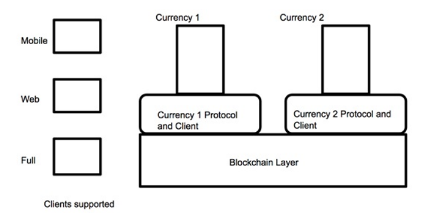
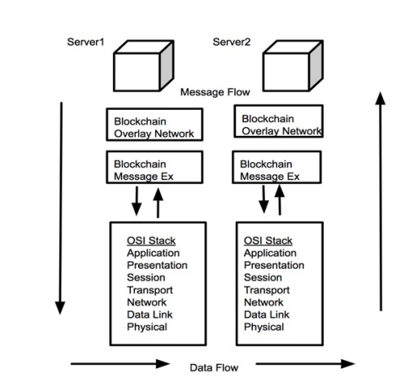
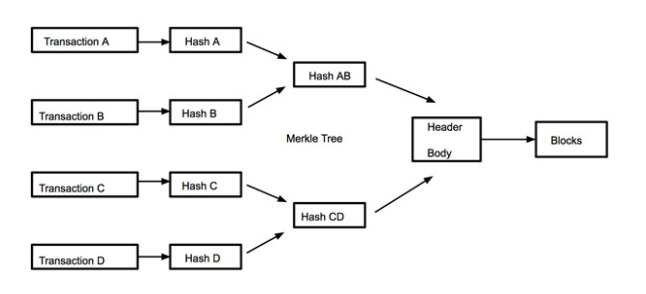
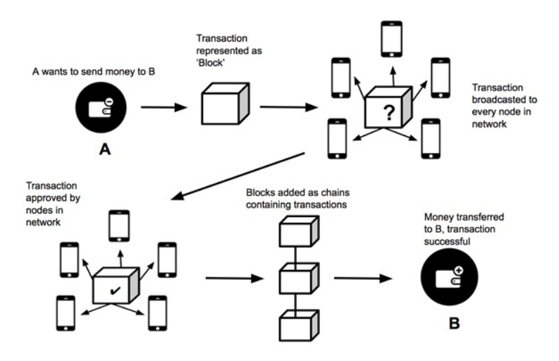
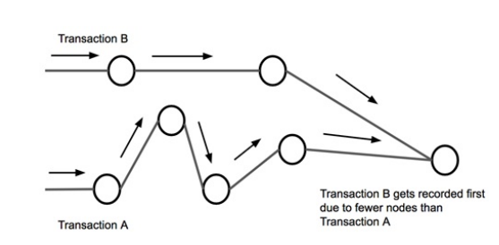
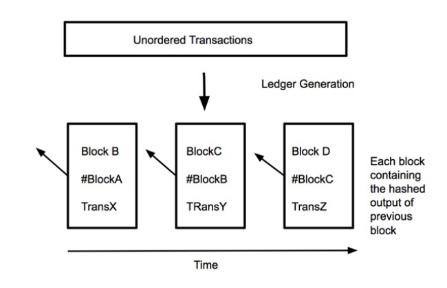

# INTRODUCTION TO BLOCKCHAIN TECHNOLOGY

Ishaani Priyadarshini

University of Delaware, Newark, DE, USA Email: IshaaniPriyadarshini@udel.edu

**Abstract** 
Data is one of the most valuable assets. With cyber criminals becoming increasingly skillful in their attempt to steal valuable data, cybersecurity tends to be one of the greatest global concerns making cyber defense mandatory. In past various techniques have been proposed owing to the security needs of various institutions , however security assaults know no bounds, hence resulting in either the techniques being weakened or futile. The latest approach to protect valuable data is the blockchain technology. In this chapter we will be taking a look at the concept of blockchain technology and how it is crucial to the security industry. As we delve a bit more into the details, we will be taking a look at the characteristics of blockchain technology, its structure, types, architecture and working. Bitcoin is one of the most widespread applications of blockchain technology, this chapter also highlights the working of bitcoins. Eventually, we discuss about few challenges faced by this technology and its scope in the future.

**Keywords:** Blockchain, Bitcoin, Cybersecurity.

## Introduction

One of the biggest cybersecurity issues faced by individuals computer users as well as corporate firms is data theft, not only because it threatens an individual’s privacy, but also because it defeats one of the primary purposes of c**ybersecurity, i.e. Confidentiality. Over the last few decades, several techniques have been proposed to deal with the issue, and many of them have been short lived, the reason being highly skilled cyber criminals. The latest addition is the Blockchain Technology. Data dispersed over the network is prone to pilferage and plagiarism and often it is impossible to trace back to the cyber criminal. Blockchain technology eliminates the issue on many levels. A blockchain may be defined as a distributed database incorporating information or a book that marks all the events and transactions, executed and shared among concerned parties. The transactions are verified and information entered can never be erased. Every transaction made had a verifiable record. Blockchain Technology finds its use in financial as well as non financial sectors.
Blockchains are public registers such that all transactions are accumulated in list of blocks 1. When several blocks keep on adding, it leads to a chain like formation. Blockchain Technology is primarily based on the concept of Cryptography and Distributed Systems. Encryption techniques have been known to obscure content, such that it is available only to the intended users. But certain information needs to be available to specific groups of people, and it invites additional risk of the information getting manipulated. Blockchains tackle the issue. When data is accessed and updated, any change made is recorded and verified. Thereafter, it is encrypted so that further changes cannot be made. These changes are then updated into the main records. It is a repetitive process and every time a change is made, the information is preserved in a new block. It is fascinating to note that the first version of the information is well connected to the latest one. Thus, the changes made could be seen by everyone, but only the latest block can be modified. Blockchain imitates a distributed database by incorporating information duplicated across the network in real time. This means that the database has multiple locations and the records are public and easily verifiable. Since there is not centralized version, data corruption is futile. Modifying records is tedious, thus making it easier to detect if someone is trying to do so. Thus, a blockchain could be thought of as a piece of data that has the following properties.

1. It is constantly updated. This makes it easier for the users to access and modify data anytime.

2. It is a Distributed system in sense that duplicated copies of data are stored and span across the network. Updating one record updates every other copy in real time.

3. It has verified data. When data is modified, it has to be verified by users using cryp- tographic techniques.

4. The data is secure because cryptographic techniques and distributed systems do not allow tampering of data and security techniques.

One way of classifying blockchains is as permissionless blockchains and permissioned blockchains. Permissionless blockchains are open, they can be connected and abandoned by any peer as a reader or writer. They are decentralized and the information is readable by users. Permissioned blockchains authorize limited readers and writers. They are managed by a central entity which decides which individuals can read or write [2].  

 
## Need for Blockchain Security

Blockchain technology offers a way to share data and ensure transparency. The parties involved are guaranteed that the data they are dealing with is error free and cannot be changed. This feature is not only beneficial in the technical domain, but also finds its use beyond that. The following are few reasons that make blockchain technology a favorite in many domains.

- It ensures transparency. Blockchain technology is an open source technology, such that other users cannot modify it. Logged data within a blockchain is difficult to alter, which makes it a relatively secure technology.

- It reduces transaction costs significantly. A blockchain does not need third party to complete peer-to-peer and business transactions. Since no middlemen are involved in the transaction, the process is faster.

- Transaction settlements are quicker for blockchain technology as compared to tradi- tional banks which rely on working hours and protocols. The location at different parts of the world further contributes to the delay. But blockchain does not have any such restrictions, thereby allowing faster transaction settlements.

- It promotes decentralisation since there is not central data hub. This allows individual transactions to be authenticated. When information is updated to different servers, even if the information comes across adversaries, a trivial amount if data will be compromised.

- Since third parties are no more involved in the transactions, users and developers take the initiative, thus introducing user controlled networks.

- movements of goods, hence leading to transparency. This simplifies several other management processes too.

- In case of irregularities being detected, one can always trace back to the point of origin, which makes investigations easy for executing required actions. This leads to quality assurance

- Blockchain technology eliminates human error since it records data and protects it from being altered. Since records are verified everytime they pass from one node to the next, accuracy is guaranteed. This ultimately leads to accountability.

- Smart and Sophisticated contracts can be easily validated, singed and enforced using blockchain technology.

- Blockchain Technology eliminates electoral fraud, thus leading to clarity in voting.

- Reliability of blockchain technology is contemplated for Stock Exchanges.

- Energy supply can be accurately tracked.

- Blockchain technology encourages Peer to Peer Global Transactions. Cryptocurrency transactions are fast, secure and cheap.

- Blockchain technology leads to data objectivity. It not only preserves integrity of data but can also alert users if data is modified. Even if data is breached for an organisation, it cannot be used, thus a balance is maintained between security and governance.  

 
- Blockchain technology is used to authenticate devices. They may soon replace pass- words, thus eliminating human intervention. This is because it does not promote centralized architecture.

- Since every transaction is time stamped and signed digitally, it highlights non repudi- ation. Even with the system’s new iteration, previous records will be stored in history log. This leads to traceability.

## Characteristics of Blockchain Technology

In the previous sections, we have familiarized ourselves with the concept of blockchain technology. We now know that blockchains serve multiple purposes. The purposed are based on some characteristics, which are presented as follows [1, 2].

- Decentralization- Blockchain technology does not rely on a centralized transaction systems to validate transactions. The involvement of central trusted agencies leads to cost and performance issues. Since a third party is not required for blockchains, they rely on cryptography and algorithms to maintain data consistency in distributed networks.

- Persistence- Validating transactions is quick in blockchain technology. Invalid trans- actions may be dropped off. Transactions which are already a part of blockchain may neither be deleted or rolled back. Data tampering could be easily realized.

- Anonymity- Users interacting with blockchains are assigned system generated ad- dresses. This masks the identity of the user.

- Auditability- Transactions in real time rely on previous unspent transactions. As cr- rent transaction gets incorporated into the blockchain, the status of unspent transac- tions changes to spent. This makes verifying and tracking transactions easy.

- Public Verifiability- The correctness of the state of system can be confirmed by any user. This is not the vase in systems that rely on central trust agencies. Users need to communicate with the agencies to obtain information about the correct state.

- Transparency- Blockchain data is updated for public verifiability. However amount of information may be restricted to users depending on their privileges.

- Privacy- Although privacy is easier to achieve in centralized systems, blockchains with specific protocols can allow certain level of privacy so safeguard sensitive infor- mation.

- Integrity- Blockchain technology protects against unauthorized modifications leading to data integrity. Since the system allows public verifiability, data integrity can be verified by anyone.

- Redundancy- Blockchain technology relies on decentralized architecture. This means that data is duplicated across all writers, unlike centralized systems which rely on backups and physical servers to achieve data redundancy.

- Trust Anchor- Trust anchor is the entity responsible for providing read and write ac- cess to a system. They are the highest authorities and they possess grant and revoke rights.  

 
## Types of Blockchains

In the previous sections, we have taken a look at the Permissioned and Permissionless blockchains. However, there is another way to classify blockchains. This classification is done on basis of blockchain networks. Blockchains have been known to be of three types, which is defined as follows.

1. Public Blockchains- Public Blockchains are open and transparent, implying that any- one can read, write or audit these. They can be reviewed by anyone at any given point of time. The decentralized consensus mechanism is responsible for decision making since no one is in charge. The proof of work (POW) and proof of stake (POS) are taken into account to make decisions. These have no access restrictions and anyone can participate in transactions and validations. Some common public blockchains are Ethereum and Bitcoin 4.

2. Private Blockchains- Private Blockchains are confined to an individual or organiza- tion. An authority is responsible for read-write operations. This authority is also responsible for selectively giving read-write access to users. The mining rights may also be given selectively, thus making it similar to centralized system, although it is cryptographically secured and cost effective too. In this blockchain, not everyone can read, write, audit or make transactions. They are permissioned blockchains. A bankchain is a typical example of Private Blockchains.

3. Consortium or Federated Blockchains- These blockchains have one or more in charges for decision making. They are semin permissioned and are represented by a group of companies or individuals. This leads to faster transactions and offers multiple point of failures, thereby preserving data. The member are responsible for making trans- actions/ decisions. They can read, write, audit and mine data. Common examples of consortium blockchains are r3 and EWF (Energy Web Foundation).

## The Architecture of Blockchain Technology

The single version of truth provided by blockchain makes use of digitally signed blocks and algorithms to carry out quick and real time transactions and documentations, which are further encrypted. The idea was proposed by Satoshi Nakamoto, who wanted to create a cryptocurrency (bitcoin) that does not rely on centralized architecture and intermediaries. Blockchains incorporate blocks which are based on pointers that connect data from previ- ous blocks. These blocks may not be altered easily, thereby ensuring security. New block validations also rely on consensus algorithms.

The end to end transaction of blockchain follows certain mechanism. In this section we will take a look at the architecture of blockchain technology responsible for its functioning. The blockchain technology architecture is based on the following 9.

1. **Blockchain Platform-** The blockchain may be defined as an application that runs on a distributed network. It is a decentralized transaction system which is transparent in sense that any node handling a blockchain software is capable of handling the en- tire blockchain. The corresponding data is stored in either a flat file or a relational database. Google’s LevelDB is accountable for storing metadata. The installed appli- cation gets synced from server to nodes. The servers encompass transaction records  

 
based on cryptographic protocols and consensus algorithms. Since the software is ro- bust, it is virtually impossible to break into the applications running. The transactions do not need third parties for authentication and validation. The transactions are veri- fied by nodes in a peer-to-peer network. When many nodes agree with respect to their blocks in individual databases, they are said to be in consensus. The three main layers of blockchain are illustrated in the following diagram. As we can see, the clients sup- ported are full, web and mobile. The blockchain layer is responsible for maintaining chain of blocks, whereas the Protocol and Client layer provides peer-to-peer protocol and consensus rules.

**Figure 6.1** Blockchain Architecture Diagram

2. **Blockchain Nodes-** Blockchain technology operates on the collaborated peer to peer (P2P) network and internet protocol of the internet. In a P2P network, there is no centralized node, and all nodes are capable of providing and consuming services. The nodes in a blockchain are responsible for maintaining duplicate copies of database which contains information related to payment and ownership. Transactions lead to nodes agreeing on updates. Nodes are responsible for different functions in a blockchain. They connect to peers and validate blockchains. Full nodes contain du- plicated database in order to verify transactions without relying on additional lookups. Nodes that store some part of database verify transactions using Simple Payment Ver- ification (SPV). Miner nodes are used to confirm transactions so that they could be- come part of the blockchains. This is done by adding data into data structures (Block), based on cryptographic protocols. Committed blocks cannot be modified since it may lead to invalidation of all other blocks, this is done to ensure data integrity. Hence, rollbacks are unattainable.

3. **Network Protocol Stack-** Blockchain nodes can discover and contact other valid nodes. The blockchain message exchange follows the process of handshaking be- tween nodes to exchange information over the network. The Blockchain Overlay Network is responsible for allowing different types of blockchains to synchronise and manages their operations. This layer can be used to support other applications as well. The following illustration depicts the information flow in a blockchain technology, the blockchain network architecture.  

Figure 6.2 Network Architecture of Blockchain

4. **Transactions-** Blockchains are used by applications to timestamp transactions. The records in a blockchain exist as transactions and blocks. Transactions may be cre- ated by clients or client applications. They have significant data that contributes to the blockchain. Sequence of transactions are stored in blocks and these blocks are created by miner nodes. In the given illustration, it is clear that when a transaction is registered in a system, a newly generated transaction is added to the blockchain node network. Minor nodes check the validity, after which it undergoes a cryptographic hashing technique to generate a unique sequence of characters. It is collaborated with other transactions and newly generated hash is stored with other metadata in a data structure header. This creates a block for which the header serves as key. This can lead to creation of the succeeding child block. In the following illustration we can com- prehend how a number of transactions get converted into blocks, which eventually are formed into chains. The transactional data part incorporates set of transactions. Merkle root is a data structure which forms part of the block header. The idea is that previously recorded transactions cannot be changed unless the block recording it and the following blocks are changed. The hash value of the previous block header is also a part of block incorporation transaction records, thereby forming chains.

Figure 6.3 How transactions get converted to Blocks  

 
## How Blockchain Technology Works

In the previous section, we have taken into account the architecture for blockchain technol- ogy/ In this section we will be dealing with how it works. The most widespread application of blockchain technology is the digital currency Bitcoin, which are created electronically and do not need a central authority to enable payment transactions. It was coined by a software developer by the name Satoshi Nakamoto in 2008. He used mathematical proofs to come up with an electronic payment system that could lead to transactions in a secure, verifiable and and inflexible way. There are a few features of bitcoin that make it different from the traditional digital currencies across the world.

1. Decentralization- As blockchain technology is decentralized, bitcoins are maintained by volunteer coders and dedicated computers over the world. A lot of individuals prefer bitcoins due to non involvement of third parties for transactions. It eradicates the double spending problem in a way that digital assets cannot be reused. Certain cryptographic protocols and algorithms ensure integrity of the transactions.

2. Limited Supply- Growing demand and constant supply lead to increase in the value of asset. Bitcoins are limited and their supply is regulated by sophisticated algorithms.

3. Pseudonymity- Bitcoin transactions do not require the identity of the sender. There is no third party to verify the identity. For a transaction to take place, all that is required is a transaction request. The protocols analyse previous transactions and make sure that the sender has sufficient bitcoins to send and the authority, before the transaction takes place.

4. Immutability- Bitcoin transactions are irreversible. This is because whenever a trans- action takes place, it stores the added new information into the blocks.

5. Divisibility- The smallest unit of bitcoin is one part of a hundred millions, roughly a hundredth of a cent. It is called as satoshi and has an edge over traditional currencies because it can also lead to microtransactions.

Traditional commerce has its own limitations ranging from financial frauds to transac- tion costs. Bitcoin proves to be an effective solution. Let us take a look at how blockchain technology works considering the popular bitcoins.

Blockchain technology eliminates the involvement of third parties for transaction val- idation and relies on cryptographic proofs for the same 10. Transactions are secured using digital signatures. The receiver has a public key to which each of the transaction is sent. The receiver uses the private key of the sender to digitally sign the transactions. The cryptocurrency owner must prove ownership of private key in order to spend the currency. The receiver of the digital currency must verify the signature and ownership of private key using the sender’s public key for the transaction to be successful.

Once the transaction takes place, it is communicated across all the nodes of Bitcoin, which has to be verified first and then registered. The validity of each transaction is a must before it is added to the public ledger. To record a transaction, a node must verify two things.

The cryptocurrency is actually owned by the spender. This is done by verifying the digital signature.

Spender is equipped with sufficient cryptocurrency to carry out the transaction. This could be done by checking every transaction recorded in the spender’s account.  

 
The following illustration exhibits the working mechanism of blockchain technology.

**Figure 6.4** Cryptocurrency transaction using Blockchain Technology

Blockchain technology was the result of developing a mechanism for Bitcoin transac- tions that the entire network would agree to. Initially, when the blockchain technology was not developed, and only bitcoins prevailed transactions did not always come in order, thus there was a need to eliminate double spending of the cryptocurrency. The transactions are passed from node to node in a bitcoin network, hence the order in which the transac- tions are received at a node, might not be the actual order of the transactions taking place. For example, Transaction A might occur before Transaction B, but the number of nodes Transaction A has to pass could be more than that of Transaction B, thus leading to Trans- action B being recorded in a node first. This was a challenge in a distributed network and the bitcoin solved this problem using blockchain technology. The transactions were then placed in blocks, thus leading to blockchains. This means that all the transactions taking place in a block have occured at the same time. The blocks are then arranged linearly in a chronological manner, in a way that a given block is linked to the previous block by its hash value.

**Figure 6.5** How double spending may occur  

 
Although the proposed method eliminated a lot of issues, one problem still remained unsolved. Multiple blocks could have been created at a given time for different nodes. Several blocks could have arrived at different nodes for different points. The problem was solved using a mathematical puzzle wherein could be accepted in a blockchain if it could answer a specific mathematical problem. This is referred to as proof of work as the node which generates a block must prove that sufficient resources have been invested to solve the puzzle.

Figure 6.6 Blockchain generation from unordered transactions

## Some other case studies for Blockchain Technology

As we know, Bitcoin is the most popular case study of the Blockchain technology. However blockchain technology is not only limited to working of cryptocurrencies. In this section we will take a look at few other use cases of blockchain technology. They are as follows [2, 7].

- Supply Chain Management- The Supply Chain Management (SCM) workflow con- sists of a number of services ranging from manufacturing, storage , production etc. to delivery and consumption. It involves multiple writers and the data that must be stored is huge. When a product moves from one hand to another, the transactions will be recorded, thereby reducing time delays and eliminating human error. Orders, re- ceipts, shipment notifications etc could be tracked down easily. Physical goods could be linked to serial numbers, barcodes, digital tags etc. Moreover information can be shared between vendors and suppliers.

- Interbank and International Financial transactions- Blockchain technology is being adopted by financial institutions for several reasons. Cross border transactions be- come a lot more quicker and cheaper. Better trade accuracy along with shorter settle- ment process is the key to share trading. Smart contracts in form of commercial trans- actions and agreements can be ensured. It strengthens identity management, which is required for banking. Since the transactions are transparent and traceable, it leads to better loyalty programs and rewards, thereby enhancing the overall performance.  

 
- Decentralized Autonomous Organisations (DAO) rely on smart cards for functioning. There is no central management, although there are rules specified in the smart con- tracts which define how the organization should behave. The organisation must be managed in a decentralized manner, hence creating the demand for permissionless blockchains. Sometimes, dedicated permissionless blockchains may also be required. These systems are usually built on top of an existing blockchain technology with its own currency.

- Land registry- The data pertaining to land registry may be moved to safe and trans- parent infrastructure secured using cryptographic protocols. SA startup by the name Chromaway is already working on the same 8.

- Proof of ownership - One of the most common case studies for blockchain technology is Proof of Ownership of Intellectual Property. A public blockchain at the time of stamping could be used to manifest ownership at a later time. The digital object along with the identity of the owner could be committed using a hash to provide sufficient evidence of ownership.

- E-Voting- One of the most important public demand for E-Voting is privacy. , since votes must be anonymous to avoid any sort of intimidation. However, there must also be public verifiability, so as to preserve integrity of the votes. Since a lot of parties are involved in voting and they do not trust each other, one of the reasonable solutions is the use of blockchain technology.

## Challenges faced by Blockchain Technology

Blockchain technology is one of the most revolutionary technological advances in recent times. They have been adopted by industries belonging to several domains like finances, healthcare, cloud storage etc. Despite its supremacy in the technological world, there are several concerns pertaining to blockchain technology. The following are some challenges faced by blockchain technology 2.

- Scalability or Network Size- With a large number of transactions taking place ev- eryday, with each block storing data, and new blocks being generated, scalability becomes a challenge. If a blockchain is not supported by a robust network, there may be several system failures. Storage optimization of blockchains or redesigning the blockchains altogether may prove to be beneficial in dealing with scalability prob- lems.

- Privacy Leakage- Blockchains do not guarantee transactional privacy. Bitcoin trans- actions may reveal personal details about users 5. IP addresses may be traced back to user pseudonyms despite the use of firewalls and Network Address Translators 6. Anonymity is one way to deal with privacy issues.

- Selfish Mining- Selfish Mining leads to insecurity of blockchains. It relies on a small amount of hashing power to make the network vulnerable. The mined blocks are kept without broadcasting and public may be able to access the private branch only if certain requirements are fulfilled. Hence selfish miners can mine private chains without the fear of losing to competitors, hence availing more revenue.  

 
- Initial Cost- Initial setup of blockchain technology is expensive as it incorporates software cost and the qualified personnel expertise. Huge demand and limited supply also contribute to the same.

- Integration with Legacy Systems- Moving to a blockchain based system may be done by either rebuilding the entire system (new blockchain based) or fuse the existing system with blockchain technology. Eradicating legacy systems may not be easy, thus the feasible solution would be to make changes to an existing system that can support blockchain technology. This may require time, money and skills.

- Energy Consumption- Validating transactions on blockchain requires computing com- plex mathematical algorithms for transaction verification and network security. Com- putations consume a lot of power and energy.

- Public Perception- Since blockchain technology is recent, lot of people are unaware of it. Many find it synonymous with bitcoins. Before the technology is adopted and applied across several domains, people must be made aware of it.

- Privacy and Security- Initially Blockchains were made visible to public. However in order to protect data and restrict access, blockchains are made permissible. This requires a lot of planning and exercise

- Complexity- Blockchain technology is based on new vocabulary which incorporates several jargons.People who are involved in work related to blockchain technology must familiarize themselves with the phrases.

- Human Error- The data contained in blockchain may not be reliable, thus events must be recorded accurately.

- Unavoidable Security Flaw- One of the remarkable security flaw in blockchains is that if more than fifty percent of the systems used as a service tell a lie, the lie become truth and is referred to as ’51% attack’. Hence it is important to monitor mining pools.

- Politics- Several public disagreements have cropped up between community sectors since bitcoin protocols can digitize governance models. There have been reports about forking of blockchains, wherein a blockchain protocol is updated.

## The Future of Blockchain Technology

We know that technologies like blockchain are capable of diminishing cyber risks, which is a global concern. Apart from that blockchain technology has been used in several indus- tries for providing specific benefits. More and more organisations are adopting blockchain technique and hopefully blockchain technology is the future of internet. Since cryptocur- rencies are becoming increasingly and financial institutions are relying on blockchaining methods, global banking may change. popular In this section, we will take a look at how this technology will impact the future 2.

- Blockchain Testing- Blockchain performances may be falsified to lure users for earn- ing profit. It is important to know which blockchain would fit business requirements thereby making blockchain testing mandatory. There are two phases to support this.  

 
In standardization phase, blockchains are tested based on certain criteria for valida- tion. The testing phase witnesses blockchains being tested for different criteria.

- Eliminating the process of centralization- Although blockchain technology is based on decentralization, selfish mining could easily take advantage of the 51% attack. This would defeat the purpose of decentralization, hence few methods must be proposed to handle the issue.

- Big data analytics- When big data is combined with blockchains, it may lead to Data management and data analytics. Data management would ensure that data is stored and secured whereas data analytics handles transactions.

- Blockchain miscellaneous applications- Blockchains could be adopted by traditional organisations for better working of their systems. The concept of smart contract could be implemented with blockchains [6].

- Combating crime- Blockchaining technology (software) has the potential to track down criminals. Apparently, it will be much more cheaper than the already exist- ing methods

- Banking sectors- Central banks could be replaced by blockchains in near future. The infrastructure costs, cross border payments and security trading could be reduced by blockchain technology.

- Industries- Blockchains may create new industry opportunities and distort the existing ones. The transactions will be quick and efficient, with no third party intervening between two end parties.

- Governments- Finance in many nations may be influenced by cryptocurrencies.

- Human Factor for authentication may be eliminated completely.

## Conclusion

In this chapter, we have introduced one of the most contemporary technologies. Cyber security happens to be the foremost priority of any nation or organization. Blockchain technology offers advanced security measures which are difficult to puncture. We have taken a look at what blockchain technology is and why it is needed in recent times. There are certain characteristics of blockchain technology that make it a favorite among cryp- tographers and we have discussed those characteristics. On basis of blockchain networks, three types of blockchains are known, which we have also highlighted in this chapter. Apart from that the architecture and working of blockchain technology is also presented. Bitcoin is one of the applications of blockchain technology, which we have emphasized on in this chapter, along with some other case studies. Even though blockchain technology is modern day savior for security issues, there are still some challenges faced by it, few of the challenges have been stated. Finally, the presumed effects of blockchain technology in future have been listed.  

 